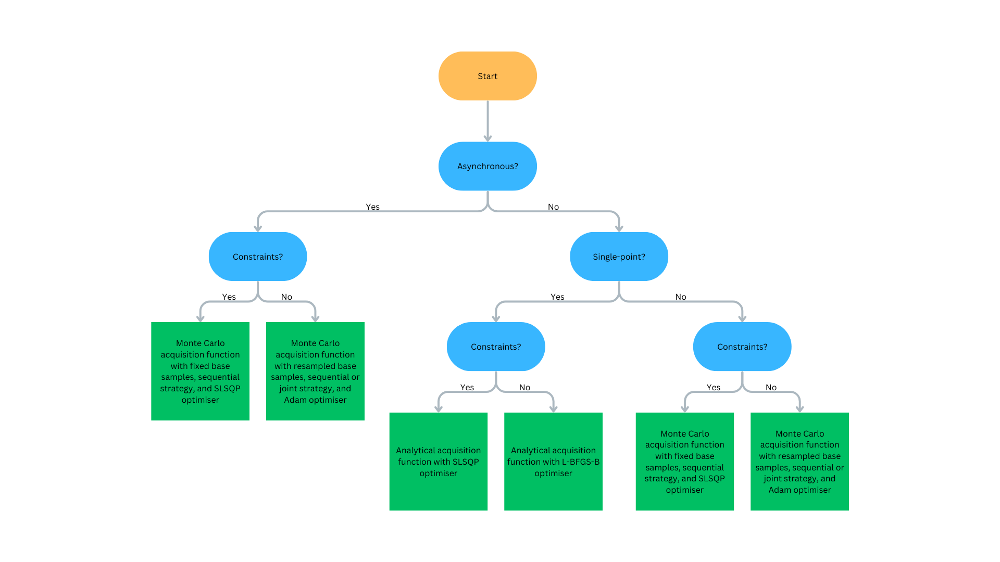

Overview
========
NUBO, short for Newcastle University Bayesian optimisation, is a Bayesian
optimisation framework for the optimisation of expensive-to-evaluate black box
functions, such as physical experiments and computer simulations. It is
developed and maintained by the `Fluid Dynamics Lab`_ at
`Newcastle University`_. NUBO focuses primarily on transparency and user
experience to make Bayesian optimisation easily accessible to researchers from
all disciplines. Transparency is ensured by clean and comprehensible code,
precise references, and thorough documentation. User experience is guaranteed
by a modular and flexible design, easy-to-write syntax, and careful selection
of Bayesian optimisation algorithms. NUBO allows you to tailor Bayesian 
optimisation to your specific problem by writing the optimisation loop yourself
using the provided building blocks. Only algorithms and methods that are
sufficiently tested and proven to perform well are included in NUBO. This
ensures that the package remains compact and does not overwhelm with an
unnecessary large number of options. The package is written in Python_ but does
not require expert knowledge to optimise your simulations and experiments. NUBO
is distributed as an open-source software under the `BSD 3-Clause licence`_.

.. admonition:: Contact
   :class: seealso

   Thanks for considering NUBO. If you have any questions, comments, or issues
   feel free to email us at m.diessner2@newcastle.ac.uk. Any feedback is highly
   appreciated and will help make NUBO better in the future.

Bayesian optimisation
---------------------
:ref:`Bayesian optimisation <bo>` [#Frazier2018]_ [#Gramacy2020]_ [#Jones1998]_
[#Shahriari2015]_ [#Snoek2012]_ is a surrogate model-based optimisation
algorithm that aims to maximise an :ref:`objective function <objfunc>` in a
minimum number of function evaluations. The underlying mathematical expression
of the objective function is usually unknown or non-existent and every function
evaluation is expensive. Solving such a function requires a cost-effective and
sample-efficient optimisation strategy. Bayesian optimisation fulfils these
criteria by representing the objective function through a 
:ref:`surrogate model <model>`, often a Gaussian process [#Gramacy2020]_
[#Williams2006]_. This representation can then be used to find the next point
that should be evaluated by maximising a criterion specified through an
:ref:`acquisition function <acquisition>`. A popular criterion is, for
example, the expected improvement (EI) [#Jones1998]_ that is the expectation of
the new point returning a better solution than the current best observation.
Bayesian optimisation is performed in a loop where training data is used to fit
the surrogate model before the next point suggested by the acquisition function
is evaluated and added to the training data itself. The loop then restarts
gathering more information about the objective function with each iteration.
Bayesian optimisation is run for as many iterations as the evaluation budget
allows, until a satisfying solution is found, or until a predefined stopping
criterion is met.

.. only:: html

    .. figure:: bo.gif

        Figure 1: Bayesian optimisation of a 1D toy function with a budget of
        20 evaluations.

Contents
--------
**Surrogate models**
  NUBO focuses on the use of Gaussian Processes as surrogates for the objective
  function. Gaussian Processes [#Gramacy2020]_ [#Williams2006]_ are specified
  through the ``GPyTorch`` package [#Gardner2018]_, a powerful package that
  allows the implementation of a wide selection of models ranging from exact
  Gaussian processes to approximate and even deep Gaussian processes.
  Hyper-parameters can be estimated via maximum likelihood estimation (MLE),
  maximum a posteriori estimation (MAP) or fully Bayesian estimation.
  
**Acquisition functions**
  NUBO supports the use of analytical acquisition functions and approximations
  through Monte Carlo sampling. Analytical expected improvement (EI)
  [#Jones1998]_ and upper confidence bound (UCB) [#Srinivas2010]_ can be used
  for sequential single-point problems where results are evaluated after each
  iteration. Multi-point   batches for parallel evaluation or asynchronous
  problems where the optimisation algorithm is continued while other points
  are still being evaluated can be performed via Monte Carlo acquisition
  functions [#Wilson2018]_.

**Optimisers**
  The deterministic analytical acquisition functions are optimised via
  multi-start L-BFGS-B [#Zhu1997]_ if the input space is restricted by box
  bounds or multi-start SLSQP [#Kraft1994]_ if the input space is also
  restricted by constraints. The stochastic Monte Carlo acquisition functions
  that are based on random samples are maximised with the stochastic optimiser
  Adam [#Kingma2015]_. NUBO also supports optimisation of mixed parameter space
  (continuous and discrete).

**Design of experiments**
  Initial data points can be generated with space-filling designs. NUBO
  supports random or maximin Latin hypercube designs [#McKay2000]_.

**Synthetic test functions**
  NUBO provides ten synthetic test functions that allow validating Bayesian
  optimisation algorithms before applying them to expensive experiments
  [#Surjanovic2023]_.

  
  Figure 2: Flowchart to determine what Bayesian optimisation algorithm is recommended.
  Click to expand.

----

.. _`Fluid Dynamics Lab`: https://www.experimental-fluid-dynamics.com
.. _`Newcastle University`: https://www.ncl.ac.uk
.. _Python: https://www.python.org
.. _`BSD 3-Clause licence`: https://github.com/mikediessner/nubo/blob/main/LICENSE.md

.. [#Frazier2018] P I Frazier, "A tutorial on Bayesian optimization," *arXiv preprint arXiv:1807.02811*, 2018.
.. [#Gardner2018] J Gardner, G Pleiss, K Q Weinberger, D Bindel, and A G Wilson, "GPyTorch: Blackbox matrix-matrix Gaussian process inference with GPU acceleration," *Advances in neural information processing systems*, vol. 31, 2018.
.. [#Gramacy2020] R B Gramacy, *Surrogates: Gaussian process modeling, design, and optimization for the applied sciences*, 1st ed. Boca Raton, FL: CRC press, 2020.
.. [#Jones1998] D R Jones, M Schonlau, and W J Welch, "Efficient global optimization of expensive black-box functions," *Journal of global optimization*, vol. 13, no. 4, p. 566, 1998.
.. [#Kingma2015] D P Kingma and J Ba, "Adam: A method for stochastic optimization," *Proceedings of the 3rd international conference on learning representations*, 2015.
.. [#Kraft1994] D Kraft, "Algorithm 733: TOMP-Fortran modules for optimal control calculations," *ACM Transactions on Mathematical Software (TOMS)*, vol. 20, no. 3, p. 262-281, 1994.
.. [#McKay2000] M D McKay, R J Beckman, and W J Conover, "A comparison of three methods for selecting values of input variables in the analysis of output from a computer code," *Technometrics*, vol. 42, no. 1, p. 55-61, 2000.
.. [#Shahriari2015] B Shahriari, K Swersky, Z Wang, R P Adams, and N De Freitas, "Taking the human out of the loop: A review of Bayesian optimization," *Proceedings of the IEEE*, vol. 104, no. 1, p. 148-175, 2015.
.. [#Snoek2012] J Snoek, H Larochelle, and R P Adams, "Practical Bayesian optimization of machine learning algorithms," *Advances in neural information processing systems*, vol. 25, 2012.
.. [#Surjanovic2023] S Surjanovic and D Bingham, "Virtual library of simulation experiments: Test functions and datasets," *sfu.ca*. [Online]. Available: https://www.sfu.ca/~ssurjano/optimization.html. [Accessed March 11, 2023].
.. [#Srinivas2010] N Srinivas, A Krause, S M Kakade, and M Seeger, "Gaussian process optimization in the bandit setting: No regret and experimental design," *Proceedings of the 27th international conference on machine learning*, p. 1015-1022, 2010.
.. [#Williams2006] C K I Williams, and C E Rasmussen, *Gaussian processes for machine learning*, 2nd ed. Cambridge, MA: MIT press, 2006.
.. [#Wilson2018] J Wilson, F Hutter, and M Deisenroth, "Maximizing acquisition functions for Bayesian optimization," *Advances in neural information processing systems*, vol. 31, 2018.
.. [#Zhu1997] C Zhu, R H Byrd, P Lu, J Nocedal, "Algorithm 778: L-BFGS-B: Fortran subroutines for large-scale bound-constrained optimization," *ACM Transactions on mathematical software (TOMS)*, vol. 23, no. 4, p. 550-560, 1997.